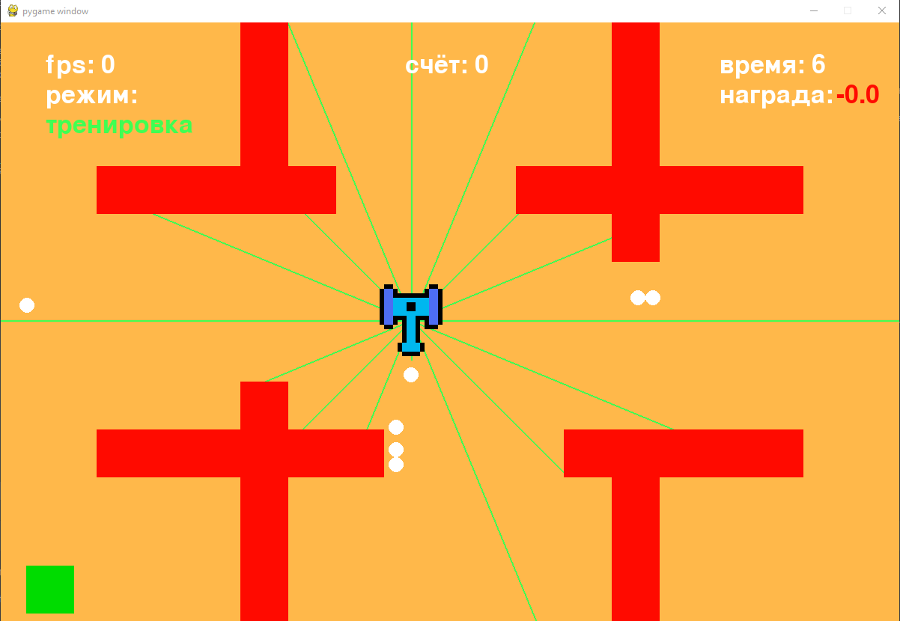
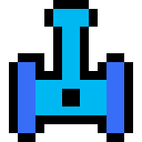
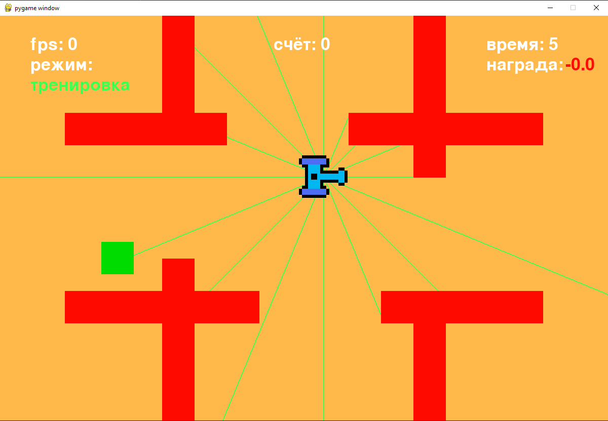
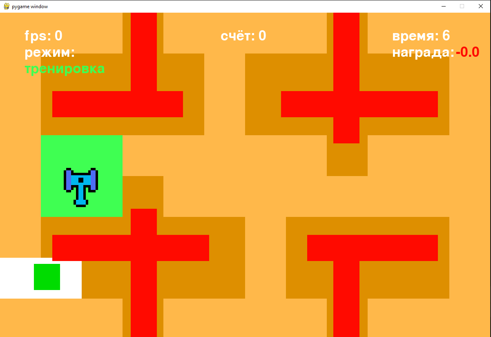

# tanksAI

## Описание

Учебный проект по обучению с подкреплением(RL). 

Представляет собой систему для проведения экспериментов с обучаемой
нейросетевой моделью. Проект реализует агента под управлением нейросети,
который обучается действовать в виртуальной среде.

Особенности:

- Поддержка различных типов входов и выходов для нейросети  
- Реализован DQN, включая варианты: **Dueling DQN, Double DQN, NoisyNet**  
- Возможность **сохранения экспериментов** для дальнейшего анализа  
- Реализована **одна среда**, в которой действует агент  

Язык: ```python-3.11```

Библиотеки:

```text
numpy
torch
matplotlib
pygame
icecream
PyYAML
noisynetworks @ git+https://github.com/thomashirtz/noisy-networks@e1bdc1349c317af01707f5f0e33b127c9a5be1e9
```

### Навигация

- [Описание](#описание)
- [Среда обучения](#среда-обучения)
- [Агент](#агент)
- [Типы входных данных агента](#типы-входных-данных-агента)
- [Типы выбора действия агента](#типы-выбора-действия-агента)
- [Система вознаграждений](#система-вознаграждений)
- [Установка](#установка)
- [Структура эксперимента](#эксперименты)
- [Запуск эксперимента](#запуск-эксперимента)
- [Cоздание нового эксперимента](#создание-нового-эксперимента)
- [Конфигурация нейросети](#конфигурация-нейросети)
- [Конфигурация эксперимента](#конфигурация-эксперимента)
- [Конфигурация проекта](#конфигурация-проекта)
- [Структура проекта](#структура-проекта)

---

## Среда обучения

Свободное пространство, ограниченное областью окна, в котором может передвигаться агент.

```Цель агента - зелёный квадрат```. Агент должен заполучить цель либо столкновением, либо попаданием выстрелом.

Можно создать препятствия для агента - ```стены```. Для этого в файле ```q_agent.py``` разместите экземпляр класса ```Wall```. Его можно найти в файле ```block.py```
```markdown
Wall(screen, (320, 0))
```

(все параметры среды настраевымые. см. подробнее ниже в [описании конфигураций](#конфигурация-эксперимента))



Так же реализованна смена режимов по нажатии англ. клавиши `X` между режимами `тренировка` при котором модель обучается и `эксплуатация` при котором обучение прекращается и агент продолжает действовать относительно логики выбранного вами типа действий агента


## Агент



Имеет 4 действия: `вверх` `вниз` `влево` `вправо`

При включенном режиме стрельбы активировав параметр `train_gun` (см. подробнее ниже в описании конфигураций) имеет 5 действие - `стрельбу`

Передвигается со скоростью ```10px``` за шаг симуляции

### нейросеть

Архитектура: ```MLP```

Задача: ```Классификация```

Алгоритмы: ```DQN```, ```Dueling DQN```, ```Double DQN```, ```NoisyNet```

## Типы входных данных агента
Реализованно 3 типа входов:

---

### lidar

<details>
<summary>Демонстрация</summary>



</details> 

Представляет собой лучи, выходящие из центра агента.

Каждый луч содержит информацию о типе объекта, с которым он пересёкся и расстояние от агента до точки пересечения
```markdown
size_lidar = lidar.size / lidar.distance
lidar_list_data += [min(1, size_lidar), lidar.type_collide_obj]
```

- ```type_collide_obj``` — всего 4 разных значений по типу объектов пересечения: 
  - ```1``` — пересечение с целью 
  - ```0.6``` — пересечение со стеной 
  - ```0.3``` — пересечение с границей окна
  - ```0``` — отсутствие пересечения с чем-либо
- ```lidar.size``` — расстояние от агента до точки пересечения в ```px```

#### параметры:

- ```mirrored``` — дублирует лучи симметрично позади агента; если false, лучи только спереди
- ```rotate``` — True - Вращает лучи относительно поворота агента.
- ```level``` — Каждый уровень увеличивает кол-во лидаров на 2. Начальный уровень ```level 1``` - 3 лидара
- ```distance``` — фиксированная длина каждого отдельного лидара. измеряется в ```px```
- ```start_angle``` — Стартовый угол первого лидара, от которого зависит угол расположения остальных лидаров


<details>
<summary>пример конфигурации</summary>

```yaml
    lidar:
        mirrored: true
        rotate: false
        level: 4
        distance: 300
        start_angle: 90
```

</details> 

---

### nearest target value

Простые типы входных данных

#### параметры:

- ```two_points``` — на вход подаются X;Y координаты агента и цели 
```markdown
[self.rect.center[0]/1200, self.rect.center[1]/800, capture_zone.rect.center[0]/1200, capture_zone.rect.center[1]/800]
```
- ```angle_and_distance``` — используются дистанция от агента до цели и угол между ними

```markdown
[self.capture_zone_side / 180, min(1200, self.capture_zone_distance) / 1200]
```

<details>
<summary>пример конфигурации</summary>

```yaml
    nearest_target_value:
        type: two_points

        two_points:
        angle_and_distance:

```

</details> 

---

### grid sensor

<details>
<summary>Демонстрация</summary>



</details> 

область указанного размера разбивается на конечное количество клеток определённого размера. Пересечение объектов с данной сеткой отражает происходящее в среде.

каждая клетка содержит информацию о типе объекта пересечения
всего 4 разных значений по типу объектов пересечения: 
  - ```1``` — пересечение с танком. При включенном отображении соответствует ```зелёному``` цвету.
  - ```0.6``` — пересечение со стеной. При включенном отображении соответствует ```оранжевому``` цвету.
  - ```0.3``` — пересечение с целью. При включенном отображении соответствует ```белому``` цвету.
  - ```0``` — отсутствие пересечения с чем-либо

#### параметры:
- ```size_cell``` — размер одной клетки в ```px``` пример: ```100 - 100X100```
- ```width_grid``` — размер сетки по ширине в ```px```
- ```height_grid``` — размер сетки по высоте в ```px```

<details>
<summary>пример конфигурации</summary>

```yaml
    grid_sensor:
        size_cell: 100
        width_grid: 1200
        height_grid: 800
```

</details> 

---

## Типы выбора действия агента

---

### get action
Стандартный выбор действия агента на основе выходных значений нейросети

#### параметры:

отсутствуют

<details>
<summary>пример конфигурации</summary>

```yaml
get_action:
```

</details> 

---

### get action random

Выбор действия с определённой вероятностью случайного действия, шанс которого уменьшается каждое кол-во шагов, которые указаны в параметре конфигурации нейросети ```action_step_train```

#### параметры:

- ```K_len_learn``` ```proc_rand``` — коэффициенты влияющие на скорость уменьшения вероятности случайного действия (см. подробнее в [коде](agent.py))


<details>
<summary>пример конфигурации</summary>

```yaml
    get_action_random:
        K_len_learn: 1
        proc_rand: 100
```

</details> 

### get action lite random

Выбор случайного действия с определённой указанной вероятностью

#### параметры:
- ```proc_rand``` — шанс случайного действия в %

<details>
<summary>пример конфигурации</summary>

```yaml
    get_action_lite_random:
        proc_rand: 5
```

</details> 

### get action stochastic

выбор действия агента на основе ```softmax```

```markdown
F.softmax(prediction[0] / temperature, dim=0)
```

#### параметры:
- ```temperature``` — коэффициент ```softmax```

<details>
<summary>пример конфигурации</summary>

```yaml
    get_action_stahiohastic:
        temperature: 0.05
```

</details> 


### get action epsilon

реализует ```epsilon-greedy``` стратегию выбора действия агента

```markdown
epsilon = max(epsilon * epsilon_decay, epsilon_min)
```

#### параметры:
- ```epsilon_init```
- ```epsilon_decay```
- ```epsilon_min```


<details>
<summary>пример конфигурации</summary>

```yaml
    get_action_epsilon:
        epsilon_init: 1
        epsilon_decay: 0.99_99_87
        epsilon_min: 0.05
```

</details> 

## Система вознаграждений

#### Параметры:

- ```capture_zone``` — награда за столкновение с целью
- ```capture_bullet``` — награда за попадание пулей в цель
- ```step``` — награда за каждый шаг симуляции
- ```gun``` — награда за выстрел


- ```approach``` — награда за приближение к цели
    - ```activate``` — включить использование этой награды
    - ```k_size_reward``` — коэффициент величины награды
    - ```min_reward``` — минимальное значение

```markdown
reward_tank += max(min_reward_approach, difference_distance)*k_size_reward_approach
```
#### Примечание

Т.к агент двигается со скоростью ```10px``` за шаг симуляции, при расчёте награды за приближение к цели (```approach```), когда агент двигается в сторону цели, максимальное значение ```difference_distance``` и соответственно ```награды``` равно ```10```


<details>
<summary>пример конфигурации</summary>

```yaml
    fitness:
        capture_zone: 1
        death: 0
        time: 0
        capture_bullet: 0
        step: -0.001
        approach:
            activate: false
            k_size_reward: 0.00009
            min_reward: -1
        gun: -0.01
```
</details> 


## Установка

1. Клонируйте проект:

```bash
git clone https://github.com/DayZDrag/tanksAI.git
```
2. Создайте свою среду python venv
```bash
python -m venv .venv
```
3. Загрузите все необходимые зависимости из файла `requirements.txt` воспользовавшись командой:
```bash
pip install -r requirements.txt
 ```

в файле `requirements-freeze.yml` находится полный список всех зависимостей с указанием их точной версии на момент даты указаной сверху в комментарии

# Эксперименты

<details>
<summary>Структура эксперимента </summary>

```text
saves/
└── <experiment_name>/
    ├── saves/
    │   ├── run_<id>/
    │   │   ├── model_steps-<step>.pth # Сохранение модели раз в определённое количество шагов
    │   │   └── model_steps-<step>-episode-<episode>-record-<record>.pth # Сохранение модели по достижению нового рекорда
    │   │   └── ...
    │   └── ...
    │   └── info_runs.json          # Метаданные по всем запускам
    ├── config_experiment.yml   # Конфигурация эксперимента
    ├── config_neural.yml       # Конфигурация модели / сети
    ├── data_graph.json         # Данные для графиков
    ├── graph.png               # Визуализация обучения
    └── info.log                # Логи эксперимента
```
</details>

## Запуск эксперимента

1. Для запуска эксперимента перейдите в файл ```config_game.py``` и измените значение переменной ```experiment``` на название эксперимента, который вы хотите запустить.

```markdown
experiment = "lidar_sensor_test_199"
```

2. После запустите файл ```q_agent.py```

## Создание нового эксперимента

1. Измените значение переменной ```experiment``` на новое уникальное название эксперимента.


2. Измените значения файлов конфигурации эксперимента ```config_neural.yml``` и ```config_experiment.yml``` на нужные вам.


3. Запустите ```q_agent.py``` для инициализации эксперимента.

После в папке ```saves``` создастся папка с названием нового эксперимента.

### примечание

Перед созданием эксперимента убедитесь, что в главном каталоге проекта
присутствуют файлы конфигурации `config_neural.yml` и `config_experiment.yml`.
При создании нового эксперимента их копии будут помещены в папку эксперимента,
где вы сможете продолжить настройку.

**Обратите внимание:** для запуска эксперимента используются конфигурационные файлы
из папки эксперимента, а не из главного каталога. Файлы из главного каталога
требуются только при создании нового эксперимента.

(см. подробнее структуру  [эксперимента](#эксперименты) или всего [проекта](#структура-проекта))


## Конфигурация нейросети
Файл конфигурации агента `config_neural.yml` позволяет настраивать:

- Параметры обучения:
  - `max_memory`, `batch_size`, `lr`, `gamma`
- Тип действия агента (`type_action`) и параметры стратегии действий
  - epsilon-greedy, случайные действия, stochastic и др.
- Архитектура модели:
  - входной размер, скрытые слои, выходные действия, Dueling/Double DQN, NoisyNet
- Фитнес-функция (награды/штрафы) за различные события
- Тип входов агента:
  - лидар (`lidar`), сеточный сенсор (`grid_sensor`), ближайшие цели (`nearest_target_value`)
- Флаги обучения (`train_long_memory`, `train_short_memory`, `train_gun`)

Примечание:

- ```size_hidden``` — используется 2 скрытых слоя с указанной размерностью. пример: ```100 - 100X100```
- ```action_step_train``` — (см. подробнее в [коде](q_agent.py))
- ```train_long_memory``` — Количество шагов итераций перед каждым обучением модели
- ```train_target_step``` — Количество шагов итераций перед каждым обучением ```target``` модели
- ```train_gun: true``` — добавляет ещё одно выходное значение нейросети. Итоговое выходное значение: ```size_output``` + 1

<details>
<summary>Пример файла конфигурации:</summary>

```yaml
agent:
    max_memory: 100_000
    batch_size: 256
    lr: 0.001
    gamma: 0.99

    type_action: get_action_epsilon

    # типы действий

    get_action:

    get_action_random:
        K_len_learn: 1
        proc_rand: 100

    get_action_lite_random:
        proc_rand: 5

    get_action_stahiohastic:
        temperature: 0.05

    get_action_epsilon:
        epsilon_init: 1
        epsilon_decay: 0.99_99_87
        epsilon_min: 0.05

    const:
        train_target_step: 1000
        action_step_train: 1000
        train_long_memory: 32

    flags:
        train_long_memory: true
        train_short_memory: false
        train_gun: false

    model:
        size_input: 38
        size_hidden: 100 # используется 2 скрытых слоя с указанной размерностью
        size_output: 4
        enable_dueling_dqn: true
        enable_double_dqn: true
        noise_bias: false

    fitness:
        capture_zone: 1
        death: 0
        time: 0
        capture_bullet: 0
        step: -0.001
        approach: # награда за приближение к цели
            activate: false
            k_size_reward: 0.00009
            min_reward: -1
        gun: -0.01

    input_type: lidar

    # типы входов

    lidar:
        mirrored: true # дублирует лучи симметрично позади агента; если false, лучи только спереди
        rotate: false # True - Вращает лучи относительно поворота агента.
        level: 4 # Каждый уровень увеличивает кол-во лидаров на 2. Начальный уровень level 1 - 3 лидара
        distance: 300
        start_angle: 90

    nearest_target_value:
        type: two_points

        two_points:
        angle_and_distance:

    grid_sensor:
        size_cell: 100
        width_grid: 1200
        height_grid: 800


```
</details>

## Конфигурация эксперимента

Каждый эксперимент настраивается отдельным YAML-файлом `config_experiment.yml` с параметрами:

- `experiment` — уникальное имя эксперимента
- Параметры загрузки модели:
  - `flag_load_model`, `flag_load_latest_model`, `name_load_model`
- Визуализация и сохранение:
  - `flag_draw`, `flag_experiment_save`
- Настройки среды:
  - `count_zones` (количество целей для агента в среде)
- Параметры обучения:
  - `save_model_step` — шаги между сохранением модели
  - `episode_step` — длина эпизода

Примечание:

- ```flag_load_latest_model: true``` — даёт возможность загружать модель из указанной папки ```run (puth_run)``` по названию в ```name_load_model```
- ```save_model_step``` — пример: 250 - 250 тыс. шагов симуляции
- ```episode_step``` — пример: 25 - 25 тыс. шагов симуляции
<details>
<summary>Пример файла конфигурации:</summary>

```yaml
experiment:
  experiment: "lidar_sensor_test_199"

  name_load_model: "model"
  path_run: 1
  flag_load_latest_model: true # даёт возможность загружать модель из указанной папки run (puth_run) по названию в name_load_model
  flag_load_model: false

  flag_experiment_save: false
  flag_draw: true

  environment:
    count_zones: 1

  train:
    save_model_step: 250 # пример: 250 - 250 тыс. шагов симуляции
    episode_step: 25 # пример: 25 - 25 тыс. шагов симуляции
```

</details>

## Конфигурация проекта

в файле ```config_game.py``` можно произвести настройку некоторых параметров проекта.

- ```experiment``` — название эксперимента с которым вы будете работать
- ```BG_SIZE``` — размер окна среды обучения нейросети
- ```flag_print_fps``` — включает отображение fps
- ```flag_debug``` — включает показ на какой строке в файле ```q_agent.py``` осуществляется вывод информации через библиотеку ```icecream``` для помощи в отладке
- ```device``` — автоматически определяет использование ```cuda``` при наличии возможности, иначе ```cpu``` . Можно принудительно поставить использование нужного вычислительного устройства. Стандартно принудительно стоит использование ```cpu```.

## Структура проекта

```text
tanksAI/
├── config/
│   ├── config.json
│   └── config.py
├── images/
│   ├── tanks
│   └── ├── tank_1.png
│       ├── tank_2.png
│       ├── tank_3.png
│       ├── tank_4.png
│
├── model/ - не участвует в проекте
├── saves/ - см. структуру эксперимента
│
├── agent.py
├── block.py
├── bullet.py
├── config_experiment.yml
├── config_experiment_loader.py
├── config_game.py
├── config_neural.yml
├── config_neural_loader.py
├── game.py
├── grid_sensor.py
├── image_loader.py
├── lidar.py
├── main.py - не участвует в проекте
├── model_q_numpy.py
├── model_q_torch.py
├── neat_agent.py  - не участвует в проекте
├── plot.py  - не участвует в проекте
├── q_agent.py - запуск экспериментов
├── README.md
├── requirements.txt
├── requirements-freeze.txt
├── tank.py
├── text.py
└── tools.py
```


